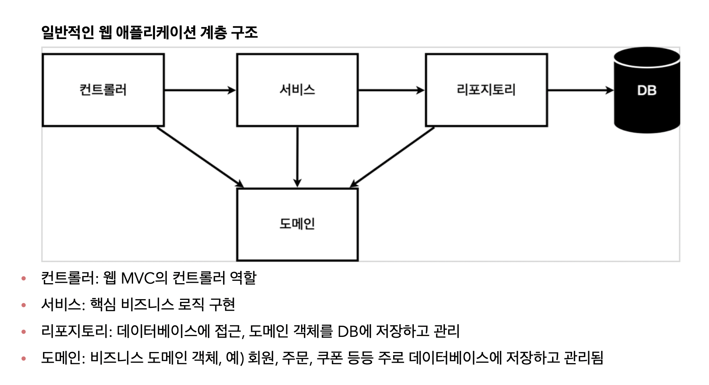

# 98_Spring


## 기본정보

- 목적 : class 기반 프로그래밍을 학습한다

- 기간 : 2021/10/15 ~ 2021/10/19

- Ref : 

  - [인프런 > 김영한 > 스프링 입문](https://www.inflearn.com/course/스프링-입문-스프링부트/dashboard)


## 1. 프로젝트 환경설정

- 프로젝트 생성
  - 스프링부트  		: 스프링 중에서 개발자 친화적인 버전
  - maven, gradle : 패키지 관리해주는 프로그램. 요즘은 gradle을 많이 쓴다
  - 폴더 구조            : src > main 에 가면 된다
  - 톰캣                    : ??
  - jar                      : 이 파일만 복제하면 다른 기기에서도 실행할 수 있다. 간편함!


- View 환경설정

  ```java
  // src > main > java > naver.items > controller > HelloController.java
  
  @Controller
  public class HelloController {
  
      @GetMapping("hello") // domain/hello 로 들어가면
      public String hello(Model model) {
          model.addAttribute("data", "hello");
          return "hello"; // templates/hello.html 을 렌더링하라
      }
  }
  ```

  

  ```html
  // src > main > resources > templates > hello.html
  
  <!DOCTYPE HTML>
  <html xmlns:th="http://www.thymeleaf.org">
  <head>
      <title>Hello</title>
      <meta http-equiv="Content-Type" content="text/html; charset=UTF-8" />
  </head>
  <body>
      <p th:text="'안녕하세요. ' + ${data}" >안녕하세요. 손님</p>
  </body>
  </html>
  ```

  

## 2. 스프링 웹 개발 기초

- 정적 컨텐츠

  - resources > static > index.html

- MVC와 템플릿 엔진 

  - HTML의 구성요소를 동적으로 바꿈

  ```java
  // controller > HelloController.java
  
  package naver.aitems.controller;
  
  import org.springframework.stereotype.Controller;
  import org.springframework.ui.Model;
  import org.springframework.web.bind.annotation.GetMapping;
  import org.springframework.web.bind.annotation.RequestParam;
  
  @Controller
  public class HelloController {
    
  		@GetMapping("hello-mvc") // domain/hello-mvc?name=jiyeon으로 들어가면
      public String hello(@RequestParam("name") String name, Model model) {
          model.addAttribute("name", name);
          return "hello-template";
      }
  }
  ```

  ```html
  // src > main > resources > templates > hello-template.html
  
  <!DOCTYPE HTML>
  <html xmlns:th="http://www.thymeleaf.org">
  <head>
      <title>Hello</title>
      <meta http-equiv="Content-Type" content="text/html; charset=UTF-8" />
  </head>
  <body>
      <p th:text="'안녕하세요. ' + ${name}" >안녕하세요. 손님</p>
  </body>
  </html>
  ```

  

- API

  - API 서버와 클라이언트 서버의 분리
  - ResponseBody 데코레이터는 데이터를 응답의 body에 담아서 보낸다
  
  ```java
  @Controller
  public class HelloController {
  
      @GetMapping("hello-string")
      @ResponseBody
      public String helloString(@RequestParam("name") String name) {
          Hello hello = new Hello();
          hello.setName(name);
          return hello;
      }
  
      static class Hello {
          private String name;
  
          public String getName() {
              return name;
          }
  
          public void setName(String name) {
              this.name = name;
          }
      }
  }
  ```


## 3-1. 회원관리 예제



- 컨트롤러 : Django의 urls.py

- 도메인 : Django의 models.py

- 리포지토리 contains methods ; save, findById, findByName, findAll

- 서비스 : Django의 views.py

  ​			 contains methods ; join, findMembers, findOne

​	

## 3-2. 테스트 관리

- 테스트는 given, when, then으로 이루어진다

- 데코레이터는 각 메소드의 역할을 알려준다

  @Test	@AfterEach	@BeforeEach

  @GetMapping	@ResponseBody

  @Override


## 4. DI : Dependency Injection

```java
public class MemberService {

    private final MemberRepository memberRepository;

    public MemberService(MemberRepository memberRepository) {
        this.memberRepository = memberRepository;
    }
}
  
class MemberServiceTest {

    MemberService memberService;
    MemoryMemberRepository memberRepository;

    @BeforeEach
    public void beforeEach() {
        // 의존성 주입 (di)
        memberRepository = new MemoryMemberRepository();
        memberService = new MemberService(memberRepository);
    }
}
```

- 스프링 컨테이너가 관리하는 객체를 빈이라 부른다

- 스프링이 빌드될 때에 컨트롤러, 서비스, 리포지토리 객체가 생성되어야 한다.
  또한 각 객체는 한번만 생성되어야 한다. 

- 방법1

  - Controller, Service, Repository 위에 @Component 데코레이터를 붙여주고, 생성자에 @Autowired 를 붙여준다
  - 각 객체는 한번만 생성되어야 하므로 데이터를 명시하면서 생성하는 것이 아니라, 데이터만 명시해두고 constructor로 객체를 생성한다.
  - final은 한번 생성되면, 다시 생성될 수 없다. static은 글로벌 변수 같은 것

  

```java
package naver.aitems;

import naver.aitems.repository.MemberRepository;
import naver.aitems.repository.MemoryMemberRepository;
import naver.aitems.service.MemberService;
import org.springframework.context.annotation.Bean;
import org.springframework.context.annotation.Configuration;

@Configuration
public class SpringConfig {

    @Bean
    public MemberService memberService() {
        return new MemberService(memberRepository());
    }

    @Bean
    public MemberRepository memberRepository() {
        return new MemoryMemberRepository();
    }
}
```

- 방법2
  - Controller에만 @Component와 @Autowired를 만든다
  - SpringConfig 파일을 만들고 의존 관계를 명시한다
- config파일은 객체와 의존관계를 관리한다.


## 5-1. 회원등록

- 컨트롤러 

  - GET : members/new
  - POST : members/new 
    - 폼 컨트롤 로직 

  - 폼 객체

- 리소스

  - 홈
  - C 폼.html
    - input의 name 

  - R.html

🏀 컨트롤러와 서비스와 리포지토리. 모델과 폼.

🏀 컨트롤러에서 폼 컨트롤, 모델 관리를 한다

🏀 서비스에서 리포지토리 관련 작업, 비즈니스 로직을 한다


## 6. DB 접근 기술

- Jdbc, Jdbc template, jpa 등 여러 기술이 있다. 세계적으로 jpa가 가장 우수하며, 코드도 간결하다.

  1) build.gradle, resources/application.propertis에 설정을 해준다
  2) domain에서 엔티티를 매핑한다

  ```java
  package naver.aitems.domain;
  
  import javax.persistence.Entity;
  import javax.persistence.GeneratedValue;
  import javax.persistence.GenerationType;
  import javax.persistence.Id;
  
  @Entity
  public class Member {
  
      @Id
      @GeneratedValue(strategy = GenerationType.IDENTITY)
      private Long id;
      private String name;
  
  }
  ```

  3. jpa repository의 로직을 생성한다

  ```java
  package naver.aitems.repository;
  
  import naver.aitems.domain.Member;
  
  import javax.persistence.EntityManager;
  import java.util.List;
  import java.util.Optional;
  
  public class JpaMemberRepository implements MemberRepository {
  		// jpa는 entity manager가 있어야 한다
      private final EntityManager em;
  
      public JpaMemberRepository(EntityManager em) {
          this.em = em;
      }
  
  
      public Member save(Member member) {
          em.persist(member);
          return member;
      }
  
  
      public Optional<Member> findById(Long id) {
          Member member = em.find(Member.class, id);
          return Optional.ofNullable(member);
      }
  
  
      public List<Member> findAll() {
          return em.createQuery("select m from Member m", Member.class)
                  .getResultList();
      }
  
  
      public Optional<Member> findByName(String name) {
          List<Member> result = em.createQuery("select m from Member m where m.name = :name", Member.class)
                  .setParameter("name", name)
                  .getResultList();
          return result.stream().findAny();
      }
  }
  ```

  4. jpa의 데이터 변경은 트랜잭션 안에서 실행해야 한다. 데이터를 변경하는 로직에 @transactional을 달아준다.

  5. config 파일을 변경해준다.

  ```java
  package naver.aitems;
  
  import naver.aitems.repository.JpaMemberRepository;
  import naver.aitems.repository.MemberRepository;
  import naver.aitems.service.MemberService;
  import org.springframework.context.annotation.Bean;
  import org.springframework.context.annotation.Configuration;
  
  import javax.persistence.EntityManager;
  import javax.sql.DataSource;
  
  @Configuration
  public class SpringConfig {
  
      private final DataSource dataSource;
      private final EntityManager em;
  
      public SpringConfig(DataSource dataSource, EntityManager em) {
          this.dataSource = dataSource;
          this.em = em;
      }
  
      @Bean
      public MemberService memberService() {
          return new MemberService(memberRepository());
      }
  
      @Bean
      public MemberRepository memberRepository() {
  //        return new MemoryMemberRepository();
  //        return new JdbcTemplateMemberRepository(dataSource);
          return new JpaMemberRepository(em);
      }
  }
  ```

  
