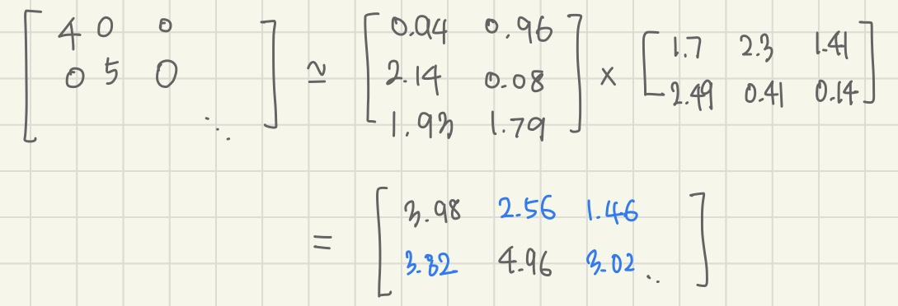

# 93_Recommendation

#### 기본 정보

- 목적 : 추천 알고리즘과 서비스를 연계해보자 + 좌충우돌

- 기간 : 2021/05, 2021/09

- Ref : 


## Before : 영화 간 유사도


- 영화를 추천하는 알고리즘을 만들어보자. [이동](https://github.com/JinJiyeon/pickcorn)

  

##### 추천 알고리즘

- 유사한 영화를 구한다 (컨텐츠 필터링 알고리즘)

- 영화는 다양한 속성을 갖는데, 이 중에 장르를 기준으로 벡터로 변환하였다. {Love, Romantic, Action, Hero} 

- NLP 에서는 단어의 등장 뿐만 아니라, 단어의 조합도 중요하게 생각한다. 이에 기반하여 {(Love, Romantic), (Love, Action), (Love, Hero)} 와 같은 쌍도 추가하였다.

- 그리고 각 벡터를 코사인 유사도를 기준으로 가까운 벡터를 추출하였다.

- movie table에 유사한 영화의 id를 저장했다.

  

##### 서비스 연계

- 유저가 좋아요한
- 유저가 플레이리스트에 담은 
- 친구가 플레이리스트에 담은

​			영화를 user table에 저장하고,
​			이와 유사한 영화를 추천해준다.


##### 개선 방향

- 나와 취향이 비슷한 사람이 좋아하는 영화를 추천해주자


## After : 유저의 취향군



##### 추천 알고리즘

- 유사한 평점 분포를 가진 item을 구한다 (협업 필터링)
- 유저를 row으로, 영화를 col로 갖는 평점 데이터를 준비한다.
- 행렬 분해를 이용해 유저가 아직 매기지 않은 평점을 예측한다.
- 행렬 분해를 할 때는 경사하강법을 응용하였다.
  행렬 분해를 할 때에 자주 사용하는 SVD, NMF는 0이 있으면 사용할 수 없다. 하지만 유저는 드물게 평점을 매기기 때문에, 평점 데이터는 0이 많다. 그래서 경사하강법에서 아이디어를 얻어, 0이 아닌 값은 큰 차이가 나지 않게 & 0인 값은 새로운 예측값으로 채워지도록 행렬을 분해한다.


##### 개선 방향

- 유저는 드물게 평점을 매긴다. 유저의 행동 ( 클릭, 검색, 리뷰 더보기 ) 등을 평점으로 변환해보자


## After : 로그를 평점 데이터로 변환

##### 서비스 연계

- 유저의 로그 기록을 평점 데이터로 변환하자


##### 로깅 툴의 이해

- 초급
  - DEBUG, INFO, WARNING, ERROR, CRITICAL.. 등의 상태에 따라 출력할 메세지를 설정할 수 있다.

```python
# myapp.py
import logging
import mylib

def main():
    logging.basicConfig(filename='myapp.log', level=logging.INFO)
    logging.info('Started')
    mylib.do_something()
    logging.info('Finished')

if __name__ == '__main__':
    main()

# mylib.py
import logging

def do_something():
    logging.info('Doing something')

# myapp.log
INFO:root:Started
INFO:root:Doing something
INFO:root:Finished
```

- 고급

  - 로깅은 로거, 핸들러, 포매터로 구성된다.

  - 로거는 모듈 별로 생성할 것을 권장한다. 로거는 이름, 상태별 메시지를 설정한다

  - 핸들러는 로그 데이터를 어떻게 출력한지 정한다. 로그 파일, 표준 출력, 전자 메일 등..

    *예를 들어, 응용 프로그램은 모든 로그 메시지를 로그 파일로 보내고, 에러(error)와 그 이상의 모든 로그 메시지를 표준 출력으로 보내고, 모든 심각한 에러(critical) 메시지를 전자 메일 주소로 보낼 수 있습니다. 이 시나리오에서는 각 처리기가 특정 심각도의 메시지를 특정 위치로 보내는 3개의 개별 처리기가 필요합니다.*

  - 포매터는 로그 메시지의 순서, 구조, 내용을 지정한다

```python
import logging

# create logger
logger = logging.getLogger('simple_example')
logger.setLevel(logging.DEBUG)

# create console handler and set level to debug
ch = logging.StreamHandler()
ch.setLevel(logging.DEBUG)

# create formatter
formatter = logging.Formatter('%(asctime)s - %(name)s - %(levelname)s - %(message)s')

# add formatter to ch
ch.setFormatter(formatter)

# add ch to logger
logger.addHandler(ch)

# 'application' code
logger.debug('debug message')
logger.info('info message')
logger.warning('warn message')
logger.error('error message')
logger.critical('critical message')

>>>
2005-03-19 15:10:26,618 - simple_example - DEBUG - debug message
2005-03-19 15:10:26,620 - simple_example - INFO - info message
2005-03-19 15:10:26,695 - simple_example - WARNING - warn message
2005-03-19 15:10:26,697 - simple_example - ERROR - error message
2005-03-19 15:10:26,773 - simple_example - CRITICAL - critical message
```

- 변수 넣기

```python
import logging
logging.warning('%s before you %s', 'Look', 'leap!')

>>> 
WARNING:root:Look before you leap!
```

