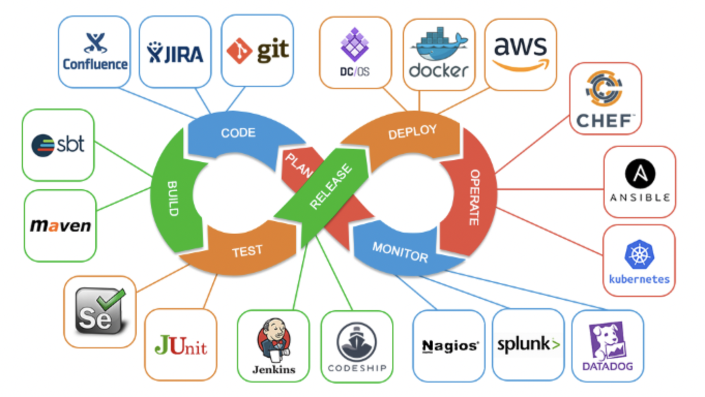
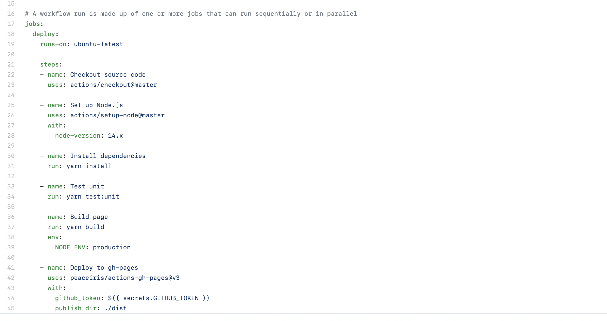
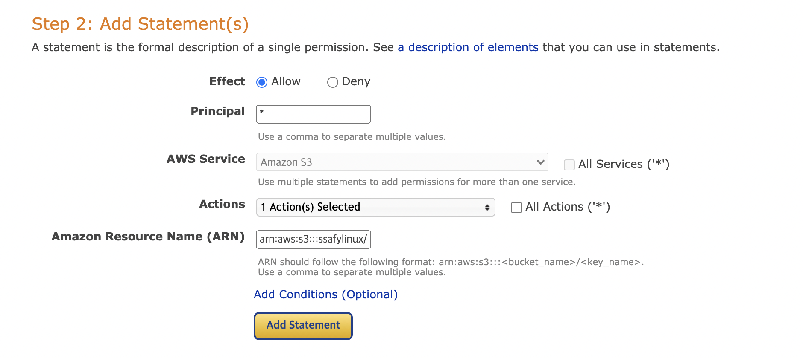

# 94_DevOps

## 기본 정보

- 목적 : DevOps를 실습하면서 CS 관련 개념을 익히자

- 기간 : 2021/06/28 ~ 2021/07/01

- Ref : 

  ​	SSAFY

## 정리

- DevOps

  개발 후에는 코드 관리, 테스트, 서버 환경 구축, 배포, 서버 관리, 모니터링 등으로 제품을 운영해야 한다.

  개발팀과 운영팀을 합쳐 서비스를 더 빠르게 + 더 효율적으로 제공하고자 하는 것이 DevOps이다.

  운영을 도와주는 여러 프로그램이 등장하고 있다

  

- PMS

  프로젝트 일정을 관리한다.

  Notion, Jira

  용어가 헷갈리는데, 프로젝트 > 스프린트 > 에픽 > 스토리 > 작업 순이다. 스프린트는 계획 개발 리뷰까지의 한 사이클 / 에픽은 업무의 대분류 / 스토리는 업무의 중분류를 의미한다.

- CI / CD

  각자 개발을 한 후에, 통합하고 / 테스트하고 / 배포하는 과정이 필요하다.

  Jenkins, Github Actions

  Github Actions는면 커밋한 내용을 자동으로 배포하게끔 도와준다. deploy.yml에 테스트, 배포를 위한 코드를 작성해주면 된다. 

  

- Docker

  여러가지 환경에서 서버를 구축할 때에, 전문지식의 부족 / OS 환경 / 이전 작업 / 시기 때문에 여러 문제가 발생한다.

  도커는 서버 환경을 이미지로 관리하여, 손쉽게 서버를 구축하도록 도와준다. 또한 서버 환경의 복사, 이전, 관리를 용이하게 한다.

  도커는 Mac, Window 등 OS에 상관없이 동일한 환경을 구성한다

- AWS

  이전에는 배포를 할 때 하드웨어를 구매했었지만, 요즘은 클라우드를 통해 배포한다.

  AWS의 S3는 데이터 저장소, EC2는 클라우드 서버, Cloud9은 EC2를 조작할 수 있는 IDE이다.

  - S3로 정적파일 배포하기

  

  - EC2로 프로젝트 배포하기

   

